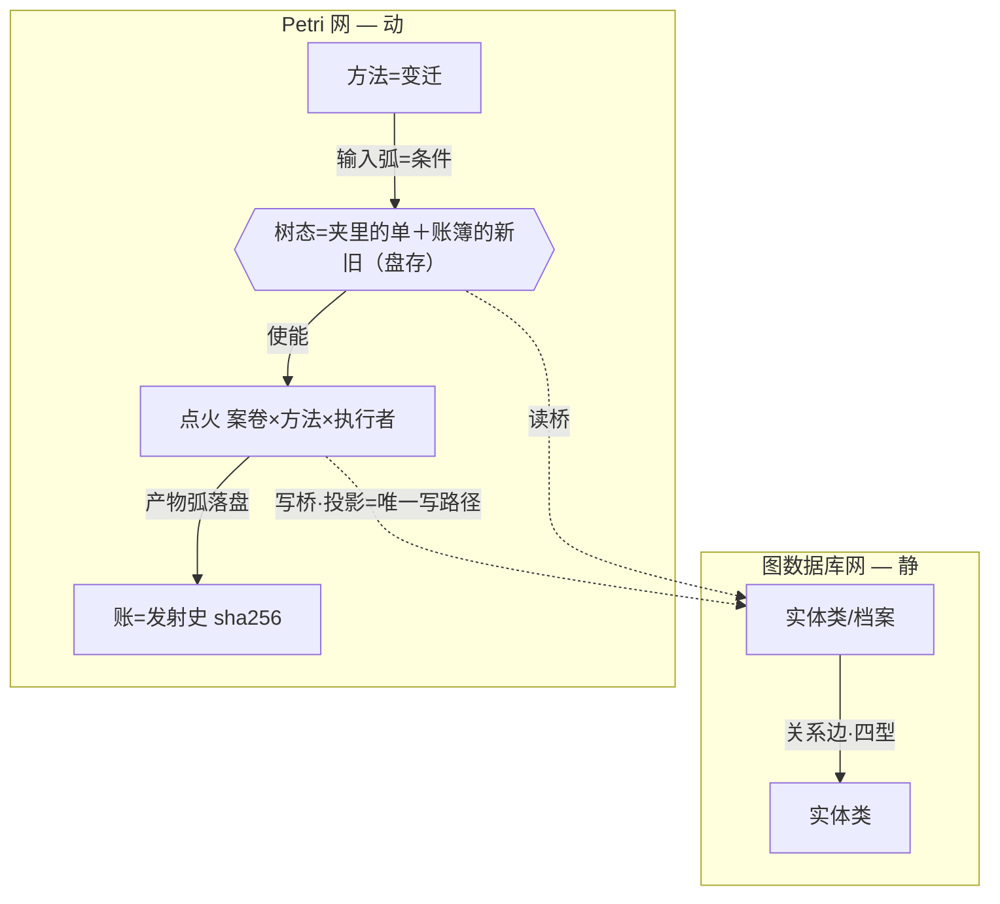
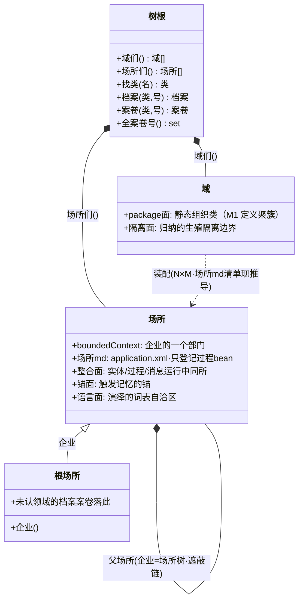
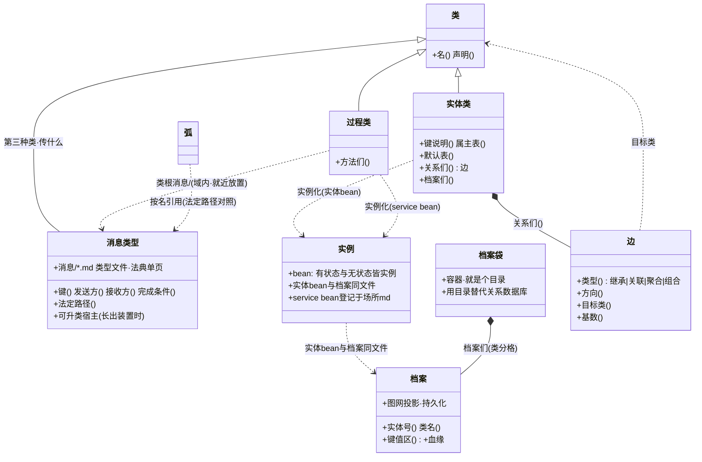
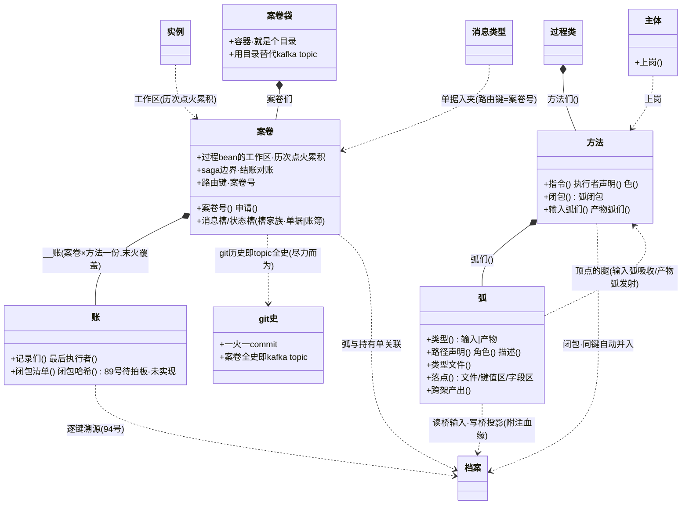
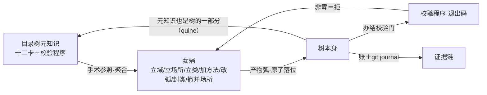

# i3dna explorer 架构

> 定位：办单人对目录树的操作台。OMP agent 是 Petri 网的 transition，
> 本文（+99/95/91 号理论）是输入弧，explorer 代码是输出弧——文档改了，
> 下一轮对话就该点火重算代码。频繁修改是设计内状态（演进态），不是欠账。
> 与其他文档（95 号逻辑模型总图、91 号两网论、actor 文档）重复没关系——
> **本文自足**，一致性只在此处维护。
> 正本在仓库 `i3dna-explorer/ARCHITECTURE.md`；vault 副本由 `i3x`
> 启动器每次启动自动覆盖——**改副本会丢，改动请落正本**。

## 哲学偏见：账房哲学，泰勒主义

先亮立场再谈设计——本文每个决定都从这三条偏见推出来，看不顺的部分
来这里找根：

**偏见一：账房哲学——宁可事后对账，不做事前设防。**并发与一致性学
人类账房：单据、流水、日结对账、印章署名、实物占有、在途容忍。
可行性不用论证——**人类两千年的实践已经证明**：从复式记账到票号
汇兑，没有数据库、没有锁，单据要式＋日结对账＋印章问责撑起了前
计算机时代大规模、跨时空、多主体的商业协作；本文只是把这套跑通了
的东西搬到目录树上。不手搓锁/CAS/版本号（ACID 是借词不是承诺，§2）；
出错的兜底是**事后对账与问责**（lint＋git 留痕＋账面 sha），不是
把所有人挡在门外。日结制：白天容忍在途（单据飞着、账挂着），打烊
前对平才结账（结账＝清零门）；不为一个柜员在打电话就全行停业（无
全局栅栏，绿任务在途照常收敛别人）。真到高并发那天用现成轮子
（SQLite/git 后账），还是不手搓。代价如实：**大批量高冲突并发
非目标**（§8.6）。

**偏见二：泰勒主义——把活拆成标准工序，把手艺写进规程，不留在
任何人脑子里。**方法是微任务：一站一事，输入/产物先声明（标准
工序）；纪律卡（开发纪律/测试纪律/审查纪律）经输入弧喂给办单
agent——树知识住树不住脑，零菜单零口传；验收断言＋lint＝检验关；
账＝计件工资表（一火一账）。计划与执行分离：树（弧声明＋使能判定）
是计划科，执行者只按工位办事——人＝绿（裁决与办结）、LLM＝蓝、
程序＝红。泰勒主义管人是**臭名昭著**（把人当机器零件），但 agent
时代它可能是**管理 agent 的最优解**：LLM 每次到场都无状态、没有
手艺可保留，"知识写进规程＋工序拆到最简"对它零成本、全收益——
上下文工程就是泰勒的工时研究；把人当零件是贬低，把 agent 当零件
是本职，人的站只留裁决不做计件。代价如实：标准工序牺牲弹性，例外
走"账外直写＋事后追认"逃生门（缺陷 18 记着这扇门目前没装锁）。

**偏见三：进化文明，不进化基因——我们不需要爱因斯坦 agent，只需要
完备的目录树。**文明靠外置的累积知识进化，从不改造人的基因；agent
（LLM）就是基因固定的工人——两代之间不会变聪明，换模型不必换树。
真正在进化的只有目录树：纪律卡、类型文件、账、档案，每轮归纳都让
树更完备，而更完备的树让平庸的 agent 干出聪明的活——聪明住树里，
不住权重里。进化靠一个闭环转起来：**演绎**＝立法构造域（女娲七法），
从域装配场所（场所.md 清单），agent 在场所中工作（方法×案卷），
留下历史（账＋单据＋档案）；**归纳**＝复盘反思场所的历史，重构域
（修正案改类定义，域保证不跨域杂交），新立法进入下一轮演绎。演绎
花掉 token，归纳攒下家底——**这个闭环就是文明进化：在树上，不在
基因里。**

三句话合起来：**账房说"怎么记账"，泰勒说"怎么干活"，进化说
"往哪里变"——树既是账本、工序手册，又是文明的基因库；引擎是
记账员兼调度台，复盘是修法议会。**

## 30 秒版本

**一句话**：i3dna explorer 是一个目录树操作台——目录树同时扮演数据库、消息队列和业务规则引擎，
全部用文件和目录实现，不依赖外部中间件。

**三个核心概念**：
- **账簿（状态槽）**：住文件，一户一页，最新版算数——余额、户口这类常驻数据
- **单据（消息槽）**：住目录，一沓共存，办完核销——审批单、返工单这类流转凭证
- **点火（变迁执行）**：柜员办一笔——吃一张单、写一笔账，暂存→验收→落位三步原子提交

**分层**：壳（Qt 渲染）→ 核（纯函数推导）→ 引擎（唯一写账者）→ lint（事后对账）

**ACID 保证**：原子性靠暂存区三步走，一致性靠日结对账（案卷结账时查残单），持久性靠树+git+账三记忆体，隔离性靠持有单（实体级写锁）。

**自举**：知识住树不住脑——纪律卡、类型文件、校验程序全在目录树上，agent prompt 每轮从树组装。变更（包括修改类定义本身）全部案卷化，经树上的变迁执行。

## 0. 术语对照（物理话 ↔ 账房话）

本文用两套词说同一件事：**账房话为主，物理话括号别名**。看不懂物理词
时查这张表——账房两千年就把这些事办完了：

| 物理话（旧词） | 账房话（本文主用） | 一句话 |
|---|---|---|
| 费米子槽 | **账簿**（状态槽） | 一户一页，最新一版算数，看账不销账 |
| 玻色子槽 | **单据**（消息槽） | 一沓共存，办完一张核销一张 |
| Pauli 互斥 | 一户一页 | 一个位置只放一本 |
| sha 定版、末火覆盖 | 结转余额、画线更正 | 最新版算数，旧版留痕（git） |
| token | 单／票 | 票据夹里的一张单 |
| uuid | 票号／流水号 | 账房从不靠票面标题认票 |
| 顺号 `__rN` | 连号票据本 | 过渡方言，票号一出就退役 |
| 主题目录（topic） | 票据夹 | 夹子定类型，纸面内容随便 |
| 文件槽上限一张 | 挂账牌 | 在场＝有事，拿走＝没事 |
| 一火一单 | 柜员一次叫一个号 | 一笔一办 |
| marking | 盘存 | 此刻柜里几本账、夹里几张单 |
| 悬账门（结账清零） | 日结 | 单据全核销才打烊 |
| 点火 | 柜员办一笔 | 吃一张单、写一笔账 |

## 1. 双网结构（91 号两网论）

目录树 = 两个正交的网叠加在同一文件系统上：

| | 图数据库网（静：有什么） | Petri 网（动：发生什么） |
|---|---|---|
| 节点/变迁 | 实体类（M1）/ 档案（M0） | 方法（任务.md） |
| 边/线 | 关系边：继承/关联/聚合/组合（四型枚举） | 弧：输入弧（条件）/产物弧（产出） |
| 标记 | 档案键值区（投影累积的物化） | **树态本身**（夹里的单＋账簿的新旧——单据到场才使能、对账才知新鲜，64 号） |
| 发射 | 图遍历（查询） | 点火 + 账（发射史） |
| 不变量 | 引用不悬空（lint 悬空检查） | 使能条件 + 守恒律 |



两座桥：**读桥**（输入弧读图网：类目录弧/类型文件/档案）、
**写桥**（投影写图网，全体系唯一写路径）。案卷与档案的关联走弧与
持有单（迁居案卷 迁20260818 经持有单__迁20260818.md 关联实体刘亦菲），
不设独立身份概念（8-20 裁定：**身份废弃，九概念第七席易主为主体**
——"是谁"归登录主体与署名问责，同键关联归机制：弧路径＋持有单＋
案卷号路由键；91 号三桥之身份桥·同键双柜由此除名，两桥为终态）。
CQRS-lite：图=读模型，Petri+账=写模型。

**域与场所正交，分工**：**域 = Java package，静态组织类**（M1 定义
聚簇：实体类/过程类/消息类型住域下；归纳=修改域的类，域保证生殖隔离
——修正案不跨域杂交）；**场所 = bounded context，运行时组织实例**
（M0 运行层：**一个场所＝目录＋场所.md＋档案袋＋案卷袋**，场所.md＝
application.xml 只登记过程类实例，未认领域落根场所）。企业=场所树（根场所=
企业，子场所=部门）。场所与域 **N:M**：`场所/<名>.md` 装配清单可跨
多域（场内类集=所列域并集，「全部」=全域；Spring 一个 context scan
多 package 的同构物）；无声明时退化为每域一部门场所（1:1 引导态）。
组织变更本身案卷化：立场所/撤并场所＝女娲七法之二（8-20 裁定立法
口归一：创建域/创建场所并入女娲，原「组织」类两法迁入后封存——封
不删留证），产物弧
`场所/{申请.场所名}.md`（**按内容取名**——引擎内容记号 `{输入名.键}`
从申请 frontmatter 代入；场所名与案卷号解耦），格式知识住
女娲/知识/场所声明格式.md 经输入弧喂给办单 agent——树知识住树不住
脑，零菜单
零代码。撤并场所走**回收弧**（产物带 `回收: 真`＝撤销动词：目标在场
才可回收，引擎先记旧 sha256 入账再删，git 留尸——删除是换算律的一
等公民）。**结构手术案卷化**：治理域「女娲」七法（立域/立场所/
立类/加方法/改弧/封类/撤并场所，封不删写封存碑）——宪法时刻（人手
立骨架）之后树自举，M1
变更同享原子落位＋账上问责＋校验门。场所三重语义：①整合——实体/过程/消息在运行中
同处一所；②记忆的锚——工作目录→场所→项目记忆（invoke_memory 已按
此工作）；③演绎的语言边界——词表场内自洽（93 号“域管语言”职责迁入
场所）。遮蔽链=场所父子解析优先级。

- **状态槽＝账簿**（物理话：费米子槽，Pauli 互斥）：一户一页（一路径
  一份），常驻可见，最新一版算数（sha 定版；旧版留痕在 git），使命是
  被反复读（需求/报告/代码/档案键值区）——看账不销账。
- **消息槽＝单据**（物理话：玻色子槽，可叠加）：一沓入夹、张张共存
  （目录槽多单共存，一请求一文件），办完一张核销一张（消费即删），
  使命是被核销（审查单/返工单/持有单）。
- **形状定律（8-21 三裁定合订：形状·身份·粒度）**：**账簿住文件，
  单据住目录**——弧指文件是读/写一个值（**账簿页**：一户一页、最新
  一版算数、看账不动账、打烊不清账簿），弧指目录是发/收单据（**票据
  夹**：一沓共存、收盘盘点、办完核销、清空才许打烊）。两网由此落形：
  图数据库网/Make 住文件（账簿），Petri 网住目录（单据）；树态＝账簿
  的新旧＋票据夹的成员清单（盘存；物理话＝费米子槽/玻色子槽，
  marking＝新鲜度＋token 集）。**一火一单**：柜员一次叫一个号——每次
  点火消费恰一张单（标准 Petri 变迁，废除旧收件箱「批量吃光」的务实
  偏离）；好处三件：一账一单（对账粒度＝单据粒度，缺陷 4 消费零痕迹
  由此闭合）、失败隔离（坏单那一笔自败，不污同批）、驳回单可指名
  （凭票号）。循环扫描即叫号：N 张单 N 轮火，打烊条件＝票据夹全空＋
  账簿全新鲜（晚到的单下轮接着叫；吃单顺序立规＝时间戳/目录序，
  确定性可复算）。**一个文件槽最多一张单**（挂账牌：在场＝有事、
  拿走＝没事——审查单/返工单合法），可能超过一张必须用目录槽；单据
  身份＝**票号 uuid**（引擎落位代起名，`审批单__<uuid4>.md`，并发
  零碰撞——账房从不靠票面标题认票）。同名覆盖（DEFECTS.md §3）根因＝
  **单据被塞进了账簿页**，顺号由此退役为过渡方言。立法载体：消息
  类型文件声明 `主题:`（目录即票据夹，该目录下一切非 `__` 文件皆此
  类型——类型判据反转为**先目录后文件名**，向后兼容）＋`命名: uuid`；
  实体类 schema 声明 `表:`（目录即分户账册，子目录即户，主文件键值
  区即栏目）。代价有界，两头立法：同键 N 单→下游 N 火（预算门护栏）；
  一火开一张（要发 N 张烧 N 轮，或一张单写 N 项——条目是内容，张数
  是流转）。
- 一等公民的根据是**承载性**不是主动性——调用者是规则引擎
  （converge/needs_fire），push/pull 是伪两难。

## 2. ACID 如何保证

> ACID 是借词不是承诺：本体系的并发模型是**人类账房**（单据/流水/
> 日结对账/印章署名/实物占有/在途容忍），非事务引擎——一致性靠事后
> 对账与问责，不靠锁。见 §8.6 哲学声明。

### A 原子性：要么全落，要么全不落

一次点火产 N 个文件。若直接让 agent 写正树，写到一半崩溃/被掐，树就是
半新半旧的撕裂态。所以引擎把点火分三步走：

1. **暂存**：agent 把全部产物写到暂存区（一个独立临时目录），正树不动。
   （例外：**字段区**不经暂存——暂存从空文件起步、落位＝整文件替换，
   恰是字段区要禁的动作；字段区由 agent 用 kv 定点直写正树＋点火前后
   键 diff 守卫回滚兜底。）
2. **验收**：引擎逐产物检查——必产文件不存在或为空 = 验收失败，整次点火
   作废（暂存区删除，正树零改动），自动重试一次再判死。
3. **落位**：验收通过后逐文件 `os.replace` 到正树（同一文件系统内原子
   替换，读方只会看到旧版或新版，不会看到半截文件）。可缺产物本轮
   未产出＝收回旧目标（删除残留，防旧 sha 让下游误判新鲜）——收缩
   与落盘同在提交点内。

失败零副作用；并发双跑后者原子覆盖，无锁不坏数据（此保证限于单文件
完整性；点火的并发互斥见 DEFECTS.md §1）。这是提交点：落位之前，本次点火等于
没发生。

### C 一致性：每一笔承诺都要兑现

体系内流动的东西分两类：**状态**（档案，落盘即常驻，如余额、户口）与
**消息**（单据，开单→消费→删单，如扣款单、入账单）。每一次点火都是一次
换算：**它消耗了哪些消息，就要产出相应的档案和新消息**。有来无回，就是
承诺丢失。

**转账例全程走一遍**（刘亦菲转 100 元给刘德华）：

1. **转账案卷开单**。人提交转账，树上开出“扣款单__转账001”（消息，落
   在刘亦菲的账户案卷槽里）。此时承诺已经存在：要扣刘亦菲 100。
2. **扣款站点火**。银行处理扣款：
   - 消耗（删除）：扣款单__转账001
   - 产出：刘亦菲余额状态 -100（档案），**并开出下一张消息**
     “入账单__转账001”（落在刘德华的账户案卷槽里）——这是新的承诺：
     要加给刘德华 100。
   
   这一步就是换算的完整形态：**一张消息死掉，一笔档案落地，一张新消息
   接力**。钱没消失，只是从“待扣”变成了“待入”。
3. **入账站点火**。银行处理入账：消耗入账单__转账001，刘德华余额 +100。
   至此消息全灭，档案全落——这笔钱的每一步都有承接。
4. **结账检查**。转账案卷结账，lint 查该案卷相关消息是否清零。

**一致性破坏长什么样**：假设第 2 步点火后系统停了——扣款单已删，刘亦菲
余额 -100，但“入账单__转账001”还躺在刘德华的槽里没人消费。案卷此时
结账，lint_case_closure 报错：

> 案卷悬账：消息「入账单」在结账案卷 转账001 在场——开出的承诺未兑现
> 或回执未销账

钱扣了、没加给任何人。**残单就是现场**：它精确指认哪一环断了（扣款成功
了、入账没发生），而不是含糊的“账对不上”。

检查点选在**案卷结账**，不选全局静止（开放系统永远有新案卷进来，全局
静止从不发生——银行不等全行停业才对账，每笔交易办结时对账）：

- **待人办与结账互斥**：等人办的单（绿任务）是飞向体系边界（人）的
  在途件，静止在场合法，但结账前必须清零——没办完就结账本身就是错误。
- **backfill = 边界入账**：人在树外直接改文件（外部世界向体系注入）后，
  用 backfill 补记一笔台账——开放体系只对边界处记账，注入不凭空消失。

> **已知破洞（§8.9）**：门声明的运行时接线三缺二——取值门零执法、直火无空夹门、
> 门弧被当消费弧。一致性保证在"门"维度有实证旁路，修法方向见 §8.9。

### D 持久性：三个记忆体各管一段

1. **树**管在场缺席——现在有什么、什么在等处理。
2. **git journal** 管历史——每次点火一个 commit，删除的单据在历史里
   可还原（单据删了不等于证据没了）。
3. **账**（`__账/<方法>/__结果.json`，**每（案卷×方法）一份，末火覆盖**
   ——回执的留存粒度是方法槽，全史由 git journal 承载）管出处——每次
   点火记下输入/产物的 sha256，谁消费了哪个版本可证。journal 是**尽力
   而为**：非 git 树（裸树/沙盒火）静默缺席、提交失败不阻断点火——
   「删单在历史可还原」只对真树＋git 在场成立。

分工动机：单据消费即删（热路径零负担），将来要回查（审计/复盘归纳）
才去 git 历史付代价挖——冷路径付代价，热路径保持简单。

### I 隔离性：持有单 = 实体级写锁

长案卷进行中，实体会处于撕裂态：迁居案卷先改了工作单位，户口住址还没
改。此刻另一个案卷读该实体，读到的是前后矛盾的组合——sha 新鲜度检测
抓不住“字段彼此不一致”（每个文件单独看都没变过），需要显式锁：

- **持有单**：`实例/<类>/<实体>/持有单__<案卷号>.md`，存在性即锁。
  迁居案卷首站开单，结账站销单。
- **读方 fail-closed**：引擎判定任务使能时，输入弧落在被持有实体目录
  下且持有者不是本 case → 直接返回“脏数据隔离”，任务不使能——工位
  面板自动显示被谁持有。
- **持有方自家放行**：持有单上的案卷号匹配本 case，自己的任务照常。
- **结账销单 = 悬账门**：结账时持有单还在 = 该案卷没释放实体 = 上面
  C 的悬账检查报错——释放动作被一致性检查兜底，不会漏。

## 3. 分层（壳/核/引擎/lint）

```
explorer(壳:渲染+事件+进程编排) → core(核:零Qt纯函数推导)
  → { engine(判定+写账), lint(对账) }
```

- 壳不做推导；核不 import Qt 不写树；引擎是唯一写账者；engine/lint/model
  互不相识（core 单一副本装载三者）。
- 判据：**核答"是什么"（读），引擎执行"变成什么"（写）**。一切业务写
  经引擎子进程；explorer 直写白名单见 §7.2（编辑器保存＋工位确认一腿＋骨架动作——账面仍全经引擎）。
- **Agent API（`i3dna-engine/i3dna_api.py`）**：不碰界面的第三类委托人
  （LLM/脚本/CI）与目录体系的交互面——读桥动词（tree/tasks/task/
  account/lint/coverage）JSON 出 stdout，拒绝也机读；写桥动词
  （fire/settle/advance/login＋draft〔103号 起草车道：草稿落案卷，零入账〕）
subprocess 直通引擎对应动词，引擎仍是
  唯一写路径。UI 与 API 同一写桥，agent 测试目录体系不必驱动 Qt。
- **老子手艺（8-19）**：泰勒主义（树上 SOP）干Routine，盘问诊断要
  老师傅——树上 `目录树元知识/知识/API手艺.md` 卡（presence-based
  技能，卡在=老子升老师傅，无卡保持快照问答，零第二登记）＋【查】
  工具环（模型单独一行【查】<读动词>，UI 代跑 api_query 白名单读桥、
  JSON 喂回再答，≤5 轮）。**写桥不白名单**：爱因斯坦可以盘问一切，
  动刀仍走工位（fire/settle 归人）。
- LLM 车道：办单助手=进程内直连 flash（零工具零 session 的薄 agent，
  记忆体=零，prompt 每轮从树重组装）；重推理走引擎子进程大模型。
  write 车道 prompt 带**类知识索引**（①本类·模板——实例由类生，类的
  知识＝实例的操作手册：本类根 知识/＋类.md＋schema.md；②沿 聚合/
  组合 边一跳的部件类 知识/ 清单。agent 按需用读文件工具自取——skill
  同构；已声明弧的文件去重；账记清单级「类知识索引」不参与对账漂移，
  必读材料仍走显式输入弧；关联/继承不级联）——读桥两腿＝弧直读＋
  类知识索引。

## 4. UI 投影（从弧声明现推导，零第二登记）

- **方法节点=定义级只读面**（预检/点火记录）；**实例节点=工位面板**
  （逐站 needs_fire 状态+预绑 case 动词：待人办→办结/need→点火）。
- **通用界面**=聊天收参+编辑器+唯一确认按钮（人与系统唯一通道，领域
  无关）；确认=保存+销单+backfill 一次事务；聊天只收集不裁决，保存归人
  （先立后破：确认按钮与老子聊天条在右键对话 S5 验收后才退役）。
- **右键对话**（101号·话语即签字）：过程类实例节点右键「对话」（未登录
  无口）→ChatDialog 以**案卷闭包**为 context（类子图＋全部方法声明＋
  案卷现状，每话语从树重组装——零会话态，会话仅内存）→话语编译为
  查询 JSON（api_query 白名单代跑读桥，≤5 轮喂回再答）或签字 JSON
  （fire/settle/advance 经 API 写桥**逐条执行逐条入账**：执行者=登录
  主体，账新增**意图=话语原文**——审计字段不入 sha 对账）；**无确认
  按钮**，发送即执行，执行后回显「说了 X→fire 了 Y」与账对照；拒=
  零副作用不入账、拒因喂回继续对话。编译车道（S5 实装 8-20）＝**持久
  omp --mode rpc 流式**（spawn 一次多轮 prompt，text_delta 逐帧打字机
  回显——实测 600 字≈531 帧铺开 6.4s；600s 看门狗＋车道自愈）；env
  I3DNA_DIALOG_CMD 子进程＝验收桩/外接车道。**查询环与签字执行全走
  后台线程**（阻塞 subprocess 不落 UI 线程——真 fire 数分钟不冻窗）。
  UI 只转发不解释：信封机械分派，语义归模型，执行归引擎。**树面现状
  先查后断**（8-20 真用例补）：断言树上有无/状态须先走读桥查询——闭包
  只带类知识＋本案卷（域/树面与 __账 不在内），缺席≠没有。
  **起草车道**（103号 审批入图·柜员的手）：信封第三模式「起草」——
  申请/产物不在场时模型起草文件内容，写桥新动词 **draft** 落案卷
  （stdin JSON 载荷；零入账；树目标须恰为本任务产物弧——防任意树写；
  内容记号任务空案卷自举：申请未落盘时记号留原样不炸——起草申请正是
  draft 的使命，批准时申请在场严格解析照旧）；
  蓝起草站（执行者=agent，如 女娲·立域起草）由 UI 自动点火（引擎=
  工具栏车道选择）产正式草稿并**回显给人过目**；人一句「批准」编译
  [draft 落位（源=案卷草稿）, settle 绿审批站]——审批入图：要人拍板的
  点在图里放绿站，agent 能干的活以自己身份 fire，「代人点火」消解。
  draft 零入账但 **journal 留尸**（8-20 裁定②/工单109：落盘后记一笔
  git 提交「起草 <方法目录> 案卷 <案卷号>」、scoped add 只加本次草稿
  ——尸骸即展示-落位绑定证据，批准步换稿两笔两尸 git diff 可证）。
- **树双视角**：目录视角=文件系统直射（域聚簇后自动长出 域/类 层级）；
  场所视角=运行时投影面（企业→部门场所→架→实例，从 域+类集 现推导，
  节点全带真路径——零第二登记）。概念上＝各场所的档案袋+案卷袋
  （袋当前由装配声明现推导，场所物理自带袋是后续迁移）。
- 树徽章/血缘高亮/工作流图/执行流图/实例 schema/工位面板——全部从
  `任务.md` 弧声明现推导。

## 5. 逻辑模型图（95 号）

两网 · 两边界 · 两袋两投影（8-19 共识：档案袋改名档案，新增案卷袋）。
九概念＝树×类×方法×弧×实例×账×主体×域×边（8-20 裁定：第七席
身份→主体，问责维度立法为概念）。概念与载体：

| 概念 | 归属 | 载体 |
|---|---|---|
| 树/边界 | 正交 | 树根/域（package·静态管类）+场所（运行时管实例，case管事务） |
| 类/实例/边 | 图网 | 类（实体/过程）＋消息类型文件（消息/*.md）/实例（bean——有状态/无状态皆实例）/关系声明 |
| 档案/档案袋 | 图网投影 | 档案＝实体类在图网的投影（键值区+血缘），持久化；档案袋＝**容器目录**——用目录替代关系数据库 |
| 案卷/案卷袋 | Petri 网投影 | 案卷＝过程 bean 的**工作区**（历次点火累积现状，不分型；saga 边界＋路由键）；案卷袋＝**容器目录**——用目录替代 kafka topic；git 历史＝topic 全史 |
| 方法/弧/账 | Petri 网 | 任务.md/输入产物弧/__账/<方法>/__结果.json（案卷×方法一份·末火覆盖·全史在 git journal） |
| **场所** | **运行时层** | **bounded context＝企业一部门：目录＋场所.md（application.xml·只登记过程类实例）＋档案袋＋案卷袋；未认领域→根场所** |


**图数据库网（类/实例/边/档案）**——静：有什么



**Petri 网（方法/弧/案卷/账）**——动：发生什么



### 概念讲解

**树**——整个文件系统就是模型本身，概念的宿主。树根管理一切：域们
（静态组织）、场所们（运行时组织）、找类、造档案、立案卷。树没有
外置"数据库"——档案袋/案卷袋（目录）就是关系数据库与 kafka topic
的替代物：目录结构就是结构，文件内容就是内容。


**域**——Java package，管理类的集合（静态组织：实体类/过程类/消息
类型住域下）。**归纳就是修改域的类**——复盘归纳的修正案改的是类定义，
域保证生殖隔离：修正案只在场内生效，不跨域杂交。跨域不共享内部模型，
只走显式接口（共享库所路径/消息）。（剃刀 90 号已除名 域主/职责/
跨域白名单 三幽灵字段——图上不画；树上各域 frontmatter 与模型/API
仍携带，数据迁移未走，8-20 评审记。）

**边界**——事务边界：case 管事务，一笔业务归一个案卷，账按案卷归档；
结账检查（C）即事务 commit 时的对账。语言边界职责已在场所（演绎侧）
与域（归纳侧）各自落位。

**类**——定义的宿主，住域下（静态）。两个子种＋一类契约文件：
- **实体类**：有什么——键说明（字段共识）、属主表（谁许写哪键）、
  默认表（出生参数）、关系们（边）。
- **过程类**：做什么——方法们。业务的流程定义。
- **消息类型**（类的第三种；Kafka 类比：schema＝类，每条单据＝实例）：传什么——单据类型：键
  （契约键）、发送方/接收方、完成条件、法定路径，住 `消息/*.md`
  （类根内随域、企业根跨域兜底，遮蔽链类根先于企业根）。载体为单文件而非目录（单据散落各案卷槽）；
  无案卷，单据入夹（一请求一文件）；单据长出装置时可升类宿主。
  **要式性＝类型即效力**：不合要件的纸不是这张单——不可流通、不可
  追索（人类账房两千年：票据法）。

**实例**——Spring 四层类比（8-19 裁定，同日两校正）：域=package、
类=bean 定义、**场所=ApplicationContext（一组实例 bean 的集合）**、
实例=bean——**有状态 bean 与无状态 service bean 皆实例，过程类同样
可实例化**，可常驻无案卷（如 实例/女娲/女娲/）。实体 bean 与档案同文件（存储
直陈，非身份断言）；**过程 bean 的同一性＝案卷号**（路由键）——
同键关联归机制（弧路径＋持有单），不立概念（8-20 裁定，见 §1）；
service bean 登记在 场所.md。**变迁发生＝执行事件**（账的一条），
不是实例。{实例} 记号是引擎旧词，语义实为「本案卷」，术语债记卡。
实例是"内容"，类只是"形状"。

**档案与档案袋**——档案＝**实体类在图数据库网的投影，持久化**：键值
区（当前值）＋`__血缘.md`（键级写事件史，94 号——数据库变更日志的
对应物）。档案袋＝**档案的容器，就是个目录**：袋=库、档案=行、
血缘=变更日志——**我们用目录替代关系数据库**。场所的档案袋收本场所
装配域的全部实体档案（类分格）；未被认领的域落根场所（企业——今天
顶层的 `实例/` 即根场所的袋）。

**案卷与案卷袋**（8-19 再校正：不分型）——案卷＝**过程 bean 的
工作区**：本卷**历次点火累积的当前状态**（输入现状＋产物现状＋在途
消息槽），身兼三职——①bean 工作区；②**saga 事务边界**（结账＝对账
点，悬账检查＝消息全部 ack）；③**路由键**（案卷号＝消息文件名的
排队键）。案卷**不分型**：编译/kafka 两分住**槽家族**——状态槽＝
编译产物（最近值 sha 定版），消息槽＝kafka 消息（消费即删，**git
历史＝topic 全史**），`__账/`＝逐火回执（sha 清单）。案卷袋＝
**案卷的容器，就是个目录**——**我们用目录替代 kafka topic**；未被
认领的域的案卷同样落根场所。

**消息驱动方法（MDB 落位，8-19 裁定：落方法级，不立类种）**——
调用方式是**弧的谓词**不是类种：**输入弧含消息槽＝消息驱动方法**
（容器投递——引擎见单据到场即点火，核销＝message ack），否则
**会话方法**（按需调用：人工工位/推进）。纯 MDB 类外延为空（研发＝
产消息＋吃消息＋读状态混住），混住是常态；全由消息驱动方法组成的
过程类 ≈ MDB 类（仍是过程类）。consumer group＝过程类，consumer
实例＝案卷。Java EE 对照：

| Java EE | i3dna |
|---|---|
| package / bean 定义 / ApplicationContext | 域 / 类 / 场所 |
| entity bean | 档案（实体 bean＝实体本身，持久化投影） |
| stateless session bean | 无状态 service bean |
| stateful session bean | 有状态过程 bean（工作区＝案卷） |
| **message-driven bean** | **消息驱动方法**（弧推导，容器投递） |
| JMS destination | 消息槽（票据夹＝队列） |
| EJB container | 引擎（needs_fire/converge） |
| container-managed tx | 一火（暂存-验收-落位） |
| message ack | 消费即删＋结账悬账检查 |
| topic 全史 | git 历史 |
| routing key | 案卷号 |
| saga | 案卷（结账＝对账点） |

**边**——实体类之间的关系声明：继承/关联/聚合/组合（四型枚举），带
方向、目标类、基数。图网"不成边不成网"——边是图网闭合的关键；lint
做悬空检查（档案死了，指向它的边暴露）。

**方法**——Petri 网的变迁。任务.md 声明：指令（这站干什么）、执行者
（人=绿/LLM=蓝/符号程序=红）、弧闭包（输入+产物）。变迁住网不住标识：
方法住类目录（共享形状），不复制进每个实例。

**弧**——变迁的腿，两条：输入弧=条件（单据到场才使能）、产物弧=
产出（点火落盘）。弧只管指向，不带语义——语义住类型文件（法定路径/
键/生命周期），弧指向哪个槽就继承哪个家族的规矩。落点三类：文件
（状态槽）/键值区（投影）/字段区（键级属主定点写）。
**场所**——DDD 的 bounded context，企业的一个部门；运行时层＝
**Spring ApplicationContext**：一组实例（bean）的集合（装配声明
N:M＝context scan 多 package）。**概念结构，持久化格式＝目录＋
场所.md**：一个场所下有一个 场所.md、一个档案袋、一个案卷袋。
**场所.md＝Spring 的 application.xml——权威登记处，只登记过程类的
实例**（service bean；实体档案不登记——它们是"数据库里的行"）。
物理持久化技术本可替换——实体实例落关系数据库、过程最近执行落
kafka topic——**我们用目录替代关系数据库和 kafka topic**。企业=
场所树（根场所=企业，未认领域的档案/案卷落根场所；子场所=部门）。
三重语义照旧：整合（实体/过程/消息运行中同所）、记忆的锚（工作
目录→场所→项目记忆）、演绎的语言边界（词表场内自洽）。无状态
bean（如出库类）挂场所、账落场所（§9.1 口径统一待办）。


**主体**——上岗者（人/agent/符号程序），点火三元组的第三维（案卷×
方法×执行者）。**九概念第七席（8-20 裁定：身份废弃，主体接管）**
——"谁在点火"的问责维度立法为概念：身份之"是谁"归登录主体与
署名，同键关联归机制（见 §1）。
登录主体=人员档案（员工编号+凭证键，pbkdf2 盐化哈希——/etc/shadow
同款，树上无明文、无 login.db）：登录日志经引擎 login 子命令入账
（__日志/登录_*），会话主体自动署名实例化人（办单助手不再问）与
绿任务办结执行者（backfill 账记「执行者」字段）。**启动默认主体**
（8-20 guci 偏好）：explorer 启动时树里有 刘亦菲 档案即默认登录
（登录=身份不是密码门——免验凭证、不记登录日志；无档案的树保持
未登录；点主体按钮可切换/注销）。权限管理（谁许
点火哪个方法、谁许写哪个键，与键级属主表/场所白名单同族）仍预留，
等真实需求再立。

**两网两桥**（详见 §1）：图网管"有什么"（实体/关系），Petri 网管
"发生什么"（方法/弧/账）；读桥=输入弧读图网，写桥=投影写图网（唯一
写路径）。账到档案的逐键溯源是第三条线。

注：消息类型是**类的第三种**（实体类＝有什么，过程类＝做什么，消息类型＝
传什么）——载体是 `消息/*.md` 类型文件（法典单页），每张单据是其实例
（Kafka 类比：schema＝类，每条消息＝实例；单据散落各案卷槽而非住类目录下，
是载体差异不是模型差异）。**无案卷，单据入夹**（一请求一文件是夹中一张单）。
消息类型..>方法的旧耦合已按 95 号 §3.5 修订为弧耦合
——顶点的腿（输入弧吸收/产物弧发射），调用者是规则引擎不是消息。

弧不分类：消息/状态是**槽的类型家族**（`消息/`、`状态/` 目录），
槽落入哪个家族获得哪个生命周期（在场即有效、核销即删 / 常驻只许
属主更新）；弧只管指向，语义住类型文件（法定路径/键/发送方/接收方），
查找链类根先于企业根（父子 context 遮蔽）。

**逻辑模型 = 树的 schema，lint 是 validator**：`i3dna_model.py` 是模型
的显式实现（类视图，懒读零副本），`lint_logical_model`（i3dna-lint）
是合法性总检——①顶层目录白名单②空域悬空③类根可判类种④消息类型须有
法定路径⑤实例架指向真类根（过程类=案卷袋·实体类=档案袋——类分
格；白名单收件箱/部门）。两者独立实现（检查器与被检查方不共享代码，独立见证人）。

**树的自描述**：类「目录树元知识」（治理域）——**纯 M1 元层，不实例化**
（元知识是定义不是数据，无档案）：`知识/` 十二卡（双网/弧记号/槽家族/
点火与账/悬账与持有单/域与场所/主体与登录/组织变更案卷化/类手术/
lint判据/案卷与实例/API手艺），
`校验程序/` 可执行自检。深义在本文（仓库正本，含图与论证），本类是
树上的自描述摘要：开树先读知识卡，改法＝改卡（立法走治理域）。
自描述带**可执行自检**：`校验程序/主程序.py`（第二独立见证人，与
i3dna-lint 独立实现、零仓库依赖，退出码判据）；任务可在 任务.md
frontmatter 声明 `校验: <脚本路径>`——办结入账前引擎代跑，非零退出
＝拒绝入账（零副作用）。skill 带脚本同款：任务包＝指令＋自带工具，
树的知识（含校验器）住树。

## 6. 自描述自举（self-describing & self-hosting）

**树长着自己的说明书、自己的质检员、自己的立法机关——宪法时刻之后，
一切变更（M0 点火、组织拓扑、M1 类手术）都经树上的变迁。**

### 自描述：知识住树不住脑

| 载体 | 内容 |
|---|---|
| 目录树元知识（治理域，纯 M1 不实例化） | `知识/` 十二卡（双网/弧记号/槽家族/点火与账/悬账与持有单/域与场所/主体与登录/组织变更案卷化/类手术/lint判据/案卷与实例/API手艺）＋ `校验程序/`（可执行自检） |
| Qt知识（研发域，纯 M1 不实例化） | 验收五条律/三条死路/三层体系与打桩/对象名驱动（出处 97 号） |
| 各类自带 `知识/` | 领域知识（女娲格式/场所声明格式/开发纪律…）——经输入弧喂给办单 agent |

agent 的 weight 里一个字不存：prompt 每轮从树重组装（办单助手零记忆
体）；知识变更＝改卡（立法走治理域，慢学习率）。

### 校验门：任务带脚本（skill 同构）

任务.md frontmatter 声明 `校验: <脚本路径>` → 办结入账前引擎代跑
（cwd＝树根，退出码判据）；非零＝拒绝入账（零副作用，未写账）。
元知识校验程序＝第二独立见证人：与仓库 i3dna-lint 独立实现、零仓库
依赖，拷走裸树即可自检。

### 自举：变更分层收网

| 层 | 变迁 | 例 |
|---|---|---|
| M0 点火 | 任务＝变迁（暂存验收落位） | 生成代码与测试 |
| 结构拓扑 | 女娲.立场所/撤并场所（回收弧；8-20 归一自「组织」迁入，组织封存） | 广州开发一部（立场所首案） |
| M1 类手术 | 女娲七法：立域/立场所/立类/加方法/改弧/封类/撤并场所（封不删） | 立域法·封组织 |

**回收弧**（产物带 `回收: 真`）：删除成为换算律一等公民——目标在场
才可回收，引擎先记旧 sha256 入账（「回收清单」节）再删，git 留尸；
缺席＝回收空气，响亮拒绝。

**宪法时刻与自举地板**：初始骨架（治理域四类等）由人手立——git 有
案，一次性；此后连女娲自己的手术也走女娲的案卷（quine）。递归的
地板只踩一次，踩过即自举。复盘裁决旧道（人手改类＋backfill）与
新道并存，真实使用决定合并时机。

**API 不取代女娲（8-19 裁定）**：Agent API 通车后「任何 agent＋API
即女娲」的提议被否——女娲不是能力是制度：**它改的是系统本身，改系统
必须留痕审计**（执行≠事后追认 的出处语义、办结校验门、内容记号产物
形状契约，三样直写给不了）。API＝通用手，女娲＝改系统的立法通道；
删女娲＝把手术知识赶回 agent 脑子，逆 §8.5 自举。**女娲调用必须立案**
（双闸；案卷=过程 bean 的工作区＋saga 边界，见《案卷与实例》卡）：弧带 {实例}/{申请.x}
记号——无案卷点火引擎响亮拒绝
（机制闸）；绕开引擎直写由 **lint ⑦ 无照手术检查**接住（警告级·劝告
不闸门）：手术面（类.md/schema.md/方法/*/任务.md）须有出处——
`女娲/知识/宪法时刻.md` 基线——**两表合并**（8-19 裁定：女娲领域
无关）：女娲自举骨架表（女娲自身＋目录树元知识，9 面——七法任务＋
两 类.md）＋ 树根
`知识/宪法时刻-领域面.md` 的领域面大赦（面数以表为准·8-20 现值 44，企业层承载领域）
或任一账目产物；新面无账目出处＝「无照手术」，基线面手改＝「手术后
手改」，删除不在场＝「应走回收弧」（回收清单销账豁免）。无女娲的树
检查休眠。



## 7. 不变式（改代码前的自检清单）

1. 核不 import Qt；壳不做推导——新逻辑先问"这是事实推导还是渲染？"
2. 一切业务写经引擎子进程；explorer 直写白名单＝编辑器保存（人手）＋
   工位确认销单（§4「保存+销单+backfill 一次事务」的一腿）＋骨架动作
   （实例化/立案卷/造空槽——造目录不造账；引擎未使能守门＋backfill
   兜底）——账面仍全经引擎
3. 弧声明是唯一事实源——新投影必须从弧现推导，禁建第二登记
4. 消息槽办完核销、状态槽常驻——新增槽位先问生命周期归属（单据还是
   账簿）
5. 方法节点只读；业务动词只能在实例工位面板
6. 历史账是凭证：文件搬家时账内路径须同步，sha 对账才不虚报
7. 本文是 transition 的输入弧——改文档不改码=点火未遂，下次对话应
   先点火重算代码再开工。

## 8. 已知的缺陷

> 8-19 猎证基线：API 全树冒烟（7 树×5 读动词零崩溃）＋账-盘对账审计
> （84 账 470 条目：sha 漂移 60、缺席 21）＋本清单逐条对抗复证（17 agent
> 独立重做实验，升级主张全部复核成立）。判词：比文更糟 5 · 实证如文 5 ·
> 已过期 1。

### 引擎层

1. **converge 并发互斥靠纪律不靠机制**（8-19 比文更糟）。双 converge 并发
   实测同任务双点火、手动 fire 与 converge 并发亦复现；且账写暂存名固定
   （`__结果.json.tmp`），并发结算一方 FileNotFoundError 崩栈——「后者原子
   覆盖」只对终文件成立，写方之一会带栈死。**已修**：暂存名带 pid 后缀
   （单文件原子性照旧，末写者胜，不手搓锁）；互斥哨兵（`.在飞`，约 15 行）
   仍等真实需求。另修：帧容错——全根推进遇外类内容记号任务（缺载荷）不再
   SystemExit 炸整个 converge，按未实例化聚合跳过（女娲落地次日曾把工具栏
   扇出推进全线打断）。
2. **无消息的档案类账实差只有警告**（8-19 比文更糟）。分级机制复现：可缺
   消息=警告、输入漂移=待重审警告、产物手改=错误；但带「状态」键的账面条目
   在 lint 里**连警告都没有**（continue 在判据之前）——m1 上 6/35 条漂移零
   消息，且账面单方加一行状态键即可把产物**错误级**漂移洗成零消息（受控
   实验证实）。状态件宽容是设计内的，错误级可被洗白是判据缺口。


3. **图数据库网的边数据不是贫是脏**（8-19 比文更糟）。机制在且执法真：
   种四型枚举实测报错、悬空引用实测报错、成环守卫在。但数据面：全树实为
   **17 条边**（trade-v4=9、trade-v2=7、m1=1——原文「仅此一条」落笔把
   trade 树算漏）；17 条里 **16 条无显式种**（缺省蒙混成关联，lint 不报）；
   「类型」全自由词零校验；trade-v2 有 4 条边悬空（隶属→品类 等四目标类
   全树不存在，lint 报错在案）。修复方向：真树续落边＋存量补种＋悬空清账，
   血缘高亮从账血缘扩到关系边。
4. **图数据库网没有查询语言**（8-19 已过期大半）。最小查询面已由
   **i3dna_api.py**（§3 Agent API）落成：tree=类/边/场所三维、
   tasks/task/account --case=实例-案卷维、tasks 投影含执行者/校验/色/
   案卷们等契约键（`tasks | select(执行者==人)` 不写码可问）——五维修度
   闭了四维半。剩余缺口：**任意键问树**（i3dna_kv 是文件级访问器未挂进
   api）。Cypher 级声明式仍是远期，形态等真实使用再定。
5. **自举不完备：核心领域概念在 Python 里，不在目录树上**（8-19 实证
    如文，无知度立了可测基线）。改卡实验：整卡重写元知识卡为反规则假
    立法，lint/coverage 输出逐字节不变——卡的唯一活性消费者是办单 LLM 的
    prompt（说明书喂 agent）；连树内校验程序也硬编码概念集不读卡。基线：
    model/engine/lint 约 4.5k 行、概念字面量判定 87 处。理想终态不变：
    Python 只是通用的图数据库引擎＋Petri 网引擎，对目录树的知识无知
    （domain-blind）。修复方向（长线）不变：概念判定逐个降为树数据＋
    通用解释器，顺序从最晚近、最少耦合的概念开始（场所→组织→女娲）。
6. **ACID 押 sha256，大批量高冲突并发非目标（账房哲学声明；8-19 边界
    校准）**。立场不变：**并发模型＝人类账房**（单据/流水/日结对账/
    印章署名/实物占有/在途容忍——§2 C 的"结账时对账不选全局静止"
    就是日结制原话），不手搓 CAS/版本号。但实测边界比声明深一层：同任务
    并发 fire 的主模态不是「静默丢更新」——是一方崩栈（固定暂存名被对方
    rename，**已修** pid 后缀）＋幸存者的账把对方字节收编成 sha 恰好一致
    的**假新鲜**态（needs_fire 判新鲜、lint 无声、converge 计划 0 站——
    错归属**永不显形**）。单文件完整性承诺全程未被打破（13+ 试次账永远
    可解析、产物永远单写者完整）。真到高并发那天：人的答案是分柜与排号，
    机器的答案是现成轮子（SQLite/git 后账）——两头都不手搓。与 DEFECTS.md §13
    同根，同此哲学。

> **工程级缺陷**（已修/实现细节/可独立闭环）已拆至 [`docs/DEFECTS.md`](docs/DEFECTS.md)：
> §3 同名覆盖·顺号量子化、§4 死信、§5 PyQt6 崩溃链、§6 历史账漂移、
> §7 持有单死锁、§12 目录弧入账（盘点单）、§13 暂存名并发、§14 单据契约手术面、
> §15 收件箱吃单、§16 起草车道四小洞、§17 回收弧残壳。

7. **绿任务语义未实现（8-21 实证裁定；同日撤研发类澄清环节）**。原判
    「树上绿任务全是 send-and-wait」升级：send-and-wait 的「等」本身零
    实现。实证（研发实例1 全链复盘）：引擎侧只有两个事实机制——
    ①converge 计划永不包含绿站（批次 run-converge-234827 仅蓝红两笔
    点火）；②绿站完成走办结回填（账记「事后追认·图外执行回填」）。
    「等」三处落空：**(a) 会计等非物理等**——挂悬账＋结账门清零是全部
    约束，下游使能只看自身输入弧（绿站永不在其上），运行时零阻塞；
    **(b) 账外直写可完全绕过**——需求.md 人手保存稿账外直写进树
    （commit 66bb244 自述「账外直写,另行backfill平账」），开发凭在场＋
    新鲜四连点，从未等过澄清办结；**(c) 办结不查使能**——必选输入
    （澄清单）缺席照样落账（缺失如实披露、不拦），追认通道本性。
    fire-and-forget（无回音弧、收讫即终局）更是未立法。两轴判据保留：
    颜色＝点火权在哪（绿＝体系外：人/系统外软件/agent）× 弧型＝有无
    回音弧——蓝站也能让人等（请求审查单），「等」不是绿的专利。
    **处置（8-21）**：研发类澄清环节整体撤除——方法/澄清需求＋消息/
    澄清单＋开发的澄清单产物弧，实例侧活单与账同批清，执行流已重投影
    （手术面基线待女娲批次重定，lint ⚠×3 如实披露手改）。m1 绿站样板
    清零，待语义立法后再立——**已修·立法落地（8-21 四件套，工单4；实测：空夹门挂起/放行、草稿转正三件套一次成且转正前下游不使能、必选缺席拒办结、收讫无转正、lint 空承诺/死等两门各有钉，pytest 268 绿，m1 零回音/清空声明隔离比对逐字节一致）**：
    **一个键两种分量**——类型文件 frontmatter 声明 `回音: 有|无`
    （缺省不立法，向后兼容）。send-and-wait＝①发（询问单入主题夹：
    uuid 票号、一火一张——形状定律机器）＋②等（**空夹门**：受管任务
    的目录弧新谓词 `清空: 真`，夹内尚有未回函的单即不使能——唯一
    新原语，补「不在场才使能」；现有文法替代＝字段区计数器
    pending 等于 0）＋③**办结拿牙**（原子提交：对 uuid 核销删单＋
    草稿转正落档（sha 入账——账外直写由此收编，闭 b）＋backfill
    署名入账；必选单缺席拒办结，闭 c）＋④有界（收回权＋预算门——
    a 由②承担：门是物理停不是会计停）。fire-and-forget＝同一机器
    去掉门：办结**收讫**两件套（核销＋入账，无转正）。lint 双向门：
    回音·有而无人挂门＝空承诺（报错）；回音·无而有人挂门＝死等
    （报错）。门管停、新鲜度管重跑。**同日第二刀
    （审查类并入研发）**：代码审查改弧驱动站内关——输入＝开发说明＋
    代码三件（新鲜度点火），产物＝审查报告/审查单/review_retry 直落
    本架；跨架信箱、共享 actor、请求审查单（m1 唯一顺号声明样板）
    随之撤除。手术面 ⚠×6 如实披露（新方法「无照手术」被手术面门抓到），
    基线重定归女娲批次。

8. **悬账门全案卷口径互锁（8-21 报销003 靶场实跑实证；工单6）**。工单2
    的悬账门主题推广把「办结＝结账」按**全案卷**执法：办结查本案卷**所有**
    主题目录，只豁免本任务自己消费的。一案两队列即环形等待——真树实录
    （A2 合规审核真火后：审批夹 1 函＋知会夹 1 单）：办结 总监审批 被
    知会夹拦、办结 收阅 被审批夹拦，而两队列各只能靠这两个办结核销——
    **互锁死锁，场景在主树走不动**。工单5 夹具验证之所以通过：夹具跑没建
    知会夹（目录缺席＝检查静默）。修法方向（账房话：**柜员办一笔只核自己
    经手的票，全夹盘点是日结的事**）：普通办结的主题悬账门只辖本任务消费
    的目录（消费动作本身即清偿）＝对非消费目录休眠；全案卷悬账检查挂
    **结账站**（任务卡可声明 `结账: 真`，类内终点站承担打烊盘点；lint 的
    lint_case_closure 同语义对账已在，引擎与其互为见证）。

9. **门未接线：取值门零执法、直火无空夹门、门弧被当消费弧（8-21 靶场
    三旁路实证；工单6）**。任务卡的门声明运行时三缺二，旁路全部在一次性
    scratch 副本上取证（m1 主树停在死锁点未染）：**(a) 取值门零执法**——
    使能条件求值 `_cond_block`/`_eval_cond`（019ef8d M2 取值运行时埋）全仓
    **零调用**：直火不查、办结不查、converge 也不查。实录：批示
    「不同意」直火打款照样付 12800（制度第 5 条「不同意＝打款永不使能」
    失守）；12800 的单**经理**办结入账成功（审批矩阵 <5000/≥5000 对开
    运行时无人执法——任务卡自述「门上的单轮不到你，菜单也不会给你待办」
    成了空话）。**(b) 空夹门不辖直火**——`drain` 只在 _task_needs_fire
    （converge 车道）：审批函在场直火打款照样点火（工单4 的「物理停」
    只停自动循环，不停直火）。**(c) 门弧被当消费弧**——fire 的一火一单
    消费不区分 `清空: 真`（等清空的只读门）与消费弧：直火打款把该由
    总监审批核销的审批函**吃掉**（消费清单记在打款账下，核销权旁落）。
    修法方向：**三车道同门**——fire 前置接 `_cond_block`（弧上条件逐一
    核，fail-closed）＋drain 检查（门弧非空拒火）；办结同接取值门；
    一火一单消费的候选弧排除 drain 弧（清空门只读不消费，核销权归声明
    消费它的方法）。立法问题留裁：若裁定「直火＝点火权高于门」（操作员
    越门点火属人的责任、账面如实记），则 (b) 转为声明性设计——但 (a)(c)
    无论怎么裁都是洞（取值门无人执法＋核销权旁落）。

## 9. 下一步工作

1. **无状态 bean 的三视图口径统一**。出库类早绑定任务是无状态 bean——
   挂场所（类根），账落场所（"无状态 bean 账落场所"是定案表述）。现状
   三个视图口径不一：点火记录枚举实例账找不到场所账；工位面板按产物
   路径把它挂到两个实例；账实际落类根。要做：统一口径=承认场所账 +
   类节点挂"场所级工位"入口。
2. **键值区落点弧无引擎解析＋血缘只覆盖字段区**（8-19 符合性审计）。
   弧解析只认 文件＋字段区 两条写径，「目标」投影形零解析、树上零声明
   ——真有任务声明键值区落点弧时引擎无从落。同批：实体档案主文件
   （md frontmatter 键值区）的引擎写路径＋`__血缘.md` 附注（94 号血缘
   现只覆盖字段区，`实例/人员/*` 等实体档案零血缘；backfill 办结也
   零血缘）。
3. **遮蔽链场所维度**。类型文件查找现为 类根→企业根 两级近似，场所
   （父子 context）不参与查找链——等真实用例再立。