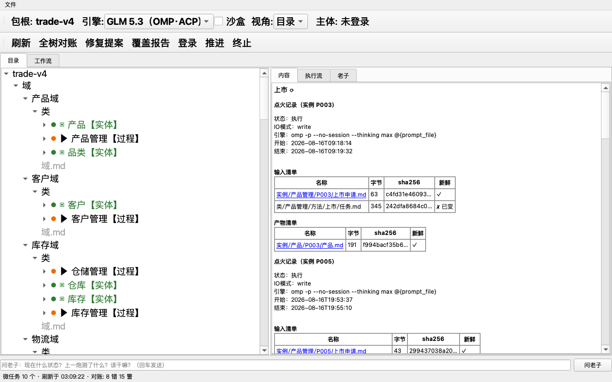

# i3dna explorer

**目录树操作台：一棵目录树同时扮演数据库、消息队列和业务规则引擎。**



类是流程定义，实例是案卷，方法（微任务）是工位。explorer 是这棵树的浏览器：
左边看树，右边看内容，右键干活——预检、点火、办结、对账、推进，全部经引擎
入账，界面上没有一笔旁路操作。

## 这是什么

一个把业务流程跑在文件系统上的实验性工作台。不建数据库、不写服务端，
目录树自己就是状态机：

- **账簿住文件**（一户一页，最新版算数），**单据住目录**（一沓共存，办完核销）
- 方法＝Petri 网的变迁；弧声明（输入/产物）是唯一事实源，节点颜色、使能
  判定、血缘高亮全部从弧现推导，零第二登记
- 三色谱分工：**绿＝人工**（机器永不代点）、**蓝＝LLM**（点火起模型子进程）、
  **红＝程序**（跑确定性代码）
- 一切写操作走「暂存→验收→落位→入账」原子提交；一致性靠**事后对账**
  （lint 查悬空引用、账实差、悬账），不靠锁

## 核心思想

架构文档亮了三条"偏见"，每个设计决定都从这里推出来：

1. **账房哲学**——宁可事后对账，不做事前设防。学人类账房：单据要式＋
   日结对账＋印章问责。两千年没有数据库也撑起了大规模跨主体协作，
   这套东西搬上目录树即可；不手搓锁/CAS/版本号。
2. **泰勒主义**——把活拆成标准工序，把手艺写进规程，不留在任何人
   脑子里。对每轮到场都无状态的 LLM 工人零成本全收益：知识住树
   不住权重，上下文工程就是泰勒的工时研究。
3. **进化文明，不进化基因**——不需要更聪明的 agent，只需要更完备的
   树。每轮归纳让树更完备，完备的树让平庸的 agent 干出聪明的活；
   换模型不必换树。

## 快速开始

依赖：Python 3（开发环境 3.13）、PyQt6、PyYAML。

```bash
pip install PyQt6 PyYAML

# 打开一棵 i3dna 树（本仓库只含操作台与引擎，不含业务树）
python3 i3dna_explorer.py <包根目录>

# 命令行/脚本走引擎 API（读桥 JSON、写桥直通）
python3 i3dna-engine/i3dna_api.py <动词> <包根> …

# 测试（143 个）
pip install -r requirements-test.txt
python3 -m pytest
```

蓝工位点火需要外部模型通路（开发环境用 OMP / DeepSeek CLI）。没有它，
浏览、红工位、办结、对账照常工作。

## 仓库结构

| 路径 | 内容 |
|---|---|
| `i3dna_explorer.py` | 壳：PyQt6 GUI（内容/执行流/对话三页） |
| `i3dna_core.py` | 核：树解析、状态叠加、视角投影 |
| `i3dna-engine/` | 引擎：点火/办结/账/journal/登录/API |
| `i3dna-lint/` | 对账：悬空引用、账实差、悬账 |
| `tests/` | 143 个测试 |
| `acceptance/evidence/` | 验收证据（50 步截图） |
| `docs/` | 快速入门、已知缺陷 |

## 文档

读的顺序建议：

1. [快速入门（10 分钟）](docs/QUICKSTART.md)——用一个转账例子走完核心概念
2. [使用手册](使用手册.md)——操作员面：启动/界面/右键菜单/日常操作（另有 [PDF](使用手册.pdf)）
3. [架构](ARCHITECTURE.md)——设计立场与全部裁决（另有 [PDF](ARCHITECTURE.pdf)）
4. [已知缺陷](docs/DEFECTS.md)

## 现状与边界

研究性项目，演进态——架构文档自述"频繁修改是设计内状态，不是欠账"。
macOS 与 Linux Mint 实测。

边界：**大批量高冲突并发非目标**——那是该上真数据库的场合；agent 组织
的弹性上限受标准工序约束，例外走"账外直写＋事后追认"逃生门。
